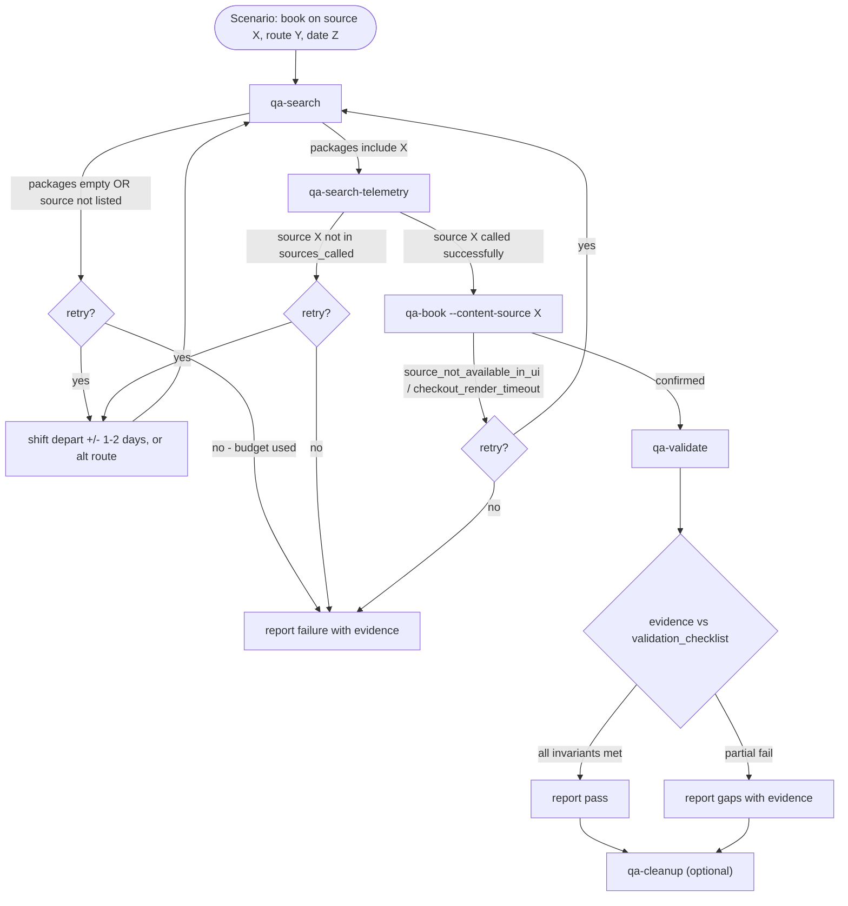

# QA Automation

Drive a real test booking on `staging{QA_STAGING_PREFIX}.flighthub.com` /
`staging{QA_STAGING_PREFIX}.justfly.com`, then validate it across the three
DB layers we care about (MySQL `ota`, ClickHouse `jupiter`, MongoDB `ota`).

Five CLI tools, each stateless. Each tool emits a **single JSON object on
stdout**; errors have an `error` key and a non-zero exit code. Stderr carries
logs only.

| Tool | Purpose |
|------|---------|
| `qa-search` | Drive the homepage search form, land on `/flight/search`, enumerate packages. Returns `search_url`, `transaction_id` (if captured), `packages`, `debug_filter_sources`. |
| `qa-search-telemetry` | ClickHouse lookup: which content sources responded for a given `transaction_id` / `search_hash`. Used to decide whether to retry search or proceed to book. |
| `qa-book` | Re-open the `search_url`, pick a package (by content source or index), autofill checkout, submit, wait for confirmation, resolve `booking_id` + `debug_transaction_id` via MySQL. |
| `qa-validate` | Dump raw evidence for a booking across MySQL / ClickHouse / MongoDB. No judgment — the agent compares the dump with `references/validation_checklist.md`. |
| `qa-cleanup` | Cancel the test booking via ResPro. Idempotent. |
| `qa-report` | Render the per-step final report (`report.md`) from the agent's classified records. See [`references/report_format.md`](references/report_format.md). |

Plus `qa-diag` for selector health checks when Playwright timeouts look like
selector rot.

Exact inputs, output schemas, and error bodies live in
[`references/tools.md`](references/tools.md).

## When to invoke

- User asks for a live booking test on staging: "book via amadeus on YUL-LAX",
  "reproduce a booking on tripstack", "end-to-end test for content source X",
  "validate a staging booking across the 3 DBs".
- User passes an existing `booking_id` / `id_hash` / `transaction_id` and asks
  to "re-validate" a prior booking without re-creating it — skip straight to
  `qa-validate`.
- User reports "Playwright keeps timing out on the search page" or "selector
  X stopped working" — run `qa-diag` first.

Do not invoke this skill for data-only investigations (bookability rates,
optimizer audits) — those use `/bookability_analysis` or `/optimizer_analysis`.

## Decision flow



Retry budget, ladder, and terminating conditions:
[`references/retry_policy.md`](references/retry_policy.md).

Known staging quirks (slow checkout render, USD override on staging2,
third-party route blocker, content-source availability swings):
[`references/known_issues.md`](references/known_issues.md).

Interpreting `qa-validate` output:
[`references/validation_checklist.md`](references/validation_checklist.md).

Current selector inventory (dated) + staging DOM notes:
[`page_inventory.md`](page_inventory.md).

## Invocation

All tools are console scripts registered in
[`qa_automation/pyproject.toml`](../../../qa_automation/pyproject.toml) and
installed by `uv sync` inside `qa_automation/`. Run them from the repo root
with `uv run` so they pick up the `.env` at the top of the repo:

```bash
cd qa_automation && uv run qa-search \
    --origin YUL --dest LAX --depart 2026-07-15 --trip-type oneway \
    --label amadeus-smoke
```

`qa-book` reuses the scenario dir from `qa-search` so all screenshots for
one attempt land in the same folder:

```bash
cd qa_automation && uv run qa-book \
    --search-url "https://staging2.flighthub.com/flight/search?..." \
    --content-source amadeus \
    --scenario-dir qa_automation/reports/20260423-130000-amadeus-smoke
```

`qa-validate` needs at least one of `--booking-id`, `--id-hash`,
`--transaction-id`. `qa-cleanup` takes `--booking-id`.

### Where to redirect stdout/stderr

When you capture a runner's JSON for inspection (e.g. piping through `jq`,
or saving for a later step), write the dumps under
`qa_automation/reports/_stdio/<tool>-<label>.{json,log}` — never next to
`pyproject.toml` or inside the `qa_automation/qa_automation/` package
dir. `qa_automation/reports/` is gitignored, so anything in `_stdio/`
stays out of the repo. Create the dir on first use:

```bash
mkdir -p qa_automation/reports/_stdio
cd qa_automation && uv run qa-search ... \
    > reports/_stdio/search-amadeus.json \
    2> reports/_stdio/search-amadeus.log
```

Per-scenario evidence (screenshots, `trace.zip`) still goes to the
scenario dir under `qa_automation/reports/<UTC-timestamp>-<label>/` —
that part is unchanged.

## Read the evidence, do not trust

`qa-validate` never returns `pass=true`. It returns rows and payloads. Read
[`references/validation_checklist.md`](references/validation_checklist.md)
and apply the invariants field-by-field before reporting an outcome. If a
check is ambiguous — say, `bookings.status = not_issued` right after book —
say so. Do not over-interpret.

## The deliverable is `report.md`

Every run ends with a single markdown file at
`{scenario_dir}/report.md`, written by `qa-report`. The body is one
canonical table — `Booking ID | Validation | Verdict | Explanation |
Proof` — with one row per invariant from
[`references/validation_checklist.md`](references/validation_checklist.md).
Verdicts are `PASS` / `FAIL` / `AMBIGUOUS` / `SKIPPED`; proofs are
either an inline-backticked SQL/Mongo query or a raw debug-log
permalink. Format spec, per-invariant proof catalogue, and a worked
example: [`references/report_format.md`](references/report_format.md).
Do not free-form summarize in chat once `report.md` is written —
quote it.

## When the UI breaks

If a runner returns `{"error": "selector_not_found", "name": "..."}`,
invoke `qa-diag --url <url> --page <page>` to list every probed selector.
Update [`qa_automation/qa_automation/pages/selectors.py`](../../../qa_automation/qa_automation/pages/selectors.py),
bump the `VERIFIED_ON` date, and refresh [`page_inventory.md`](page_inventory.md).
Do not edit selectors elsewhere — that file is the single source of truth.

## Known open items

_(none currently tracked — Summit selectors confirmed 2026-04-26 on card
[`ue37vUp5`](https://trello.com/c/ue37vUp5).)_
